# Collections Agent

An AI accounts-receivable desk built as a **Lemma pod**. It watches overdue invoices, writes the *right* follow-up for each account at the right escalation level, sends the safe ones on its own, and routes the sensitive ones to a human — with a full audit trail, live team chat, and a daily stats digest.

> Built entirely on Lemma: typed tables, Python functions, LLM agents, a durable per-invoice workflow, event + time schedules, first-class connectors (Slack, Google Sheets, Gmail), chat surfaces (Slack, Telegram), and a single-file operator app.

**Live app:** https://collections-app.apps.lemma.work · *(private — pod members only)*

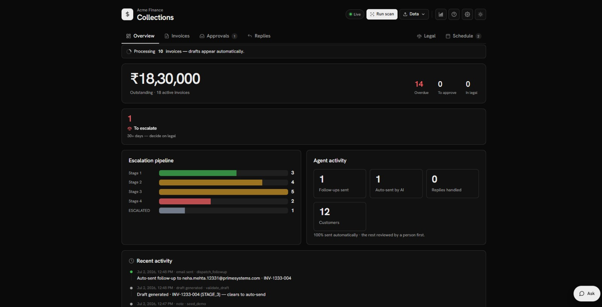
*Overview — the one number that matters, what needs a human, the escalation pipeline, and what the agent has done on its own.*

---

## Architecture

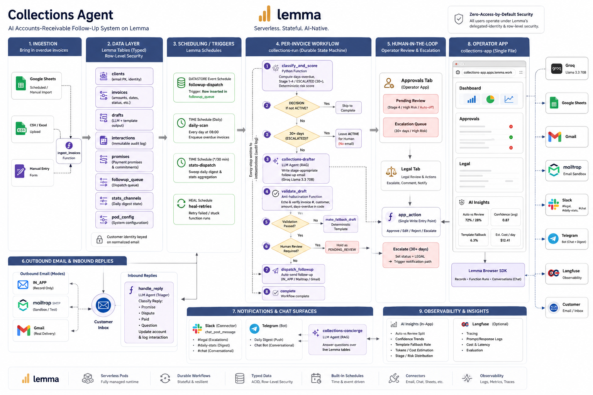
*End-to-end architecture — ingestion → typed Lemma tables → schedules/triggers → the durable per-invoice `collections-run` workflow (classify → draft → validate → auto-send or human review) → outbound email & inbound replies → Slack/Telegram notifications & chat surfaces → the single-file operator app, with observability and Lemma's zero-access-by-default security throughout.*

---

## The problem

Finance teams chase overdue invoices by hand: inconsistent tone, no audit trail, late escalations, hours of copy-paste. The hard part isn't writing *one* email — it's writing the *right* email for the right customer at the right escalation level, every day, without inventing invoice numbers or firing a stern final notice at someone who's three days late.

---

## What it does

- **Auto-triages every overdue invoice** into an escalation stage and drafts a stage-appropriate, RAG-grounded follow-up.
- **Auto-sends the safe ones**; holds Stage-4 and high-risk drafts for human approval.
- **Anti-hallucination validation** — the model must echo the invoice's real figures; any mismatch fails the draft and retries, then falls back to a deterministic template.
- **Reviewer-driven legal escalation** — 30+ day accounts stop auto-emailing and wait for a human, who escalates them to the legal team (posted to Slack `#legal`).
- **Reads customer replies** and turns them into tasks — safe asks can be answered, judgment calls wait in the Replies queue.
- **Daily stats digest** to Slack `#daily-stats` and Telegram; **chat with the pod** in Slack `#chat`, on Telegram, or the in-app assistant.
- **Explainability** — an AI-insights panel showing auto-vs-review split, confidence, template-fallback rate, and estimated token spend (optionally wired to Langfuse).

### The app (operator UI)

| Tab | For | What's there |
|---|---|---|
| **Overview** | Everyone | Outstanding, what needs a human, escalation pipeline, agent activity + audit log |
| **Invoices** | Collector | All invoices · Sent history · Customers (sub-tabs); per-row "Paid" |
| **Approvals** | Reviewer (human-in-the-loop) | **Pending review** (Stage-4/high-risk drafts) · **Escalation** (30+ accounts to send to legal) |
| **Replies** | Collector | To-do (replies needing a human) · Sent; log/answer replies |
| **Legal** | Legal team | Read queue of escalated accounts (already Slack-notified) |
| **Schedule** | Finance lead | Daily digest: what to send, when, manual send |

Top-right: **AI insights**, **Setup guide**, **Settings**, **theme**, and a docked **Ask** assistant.

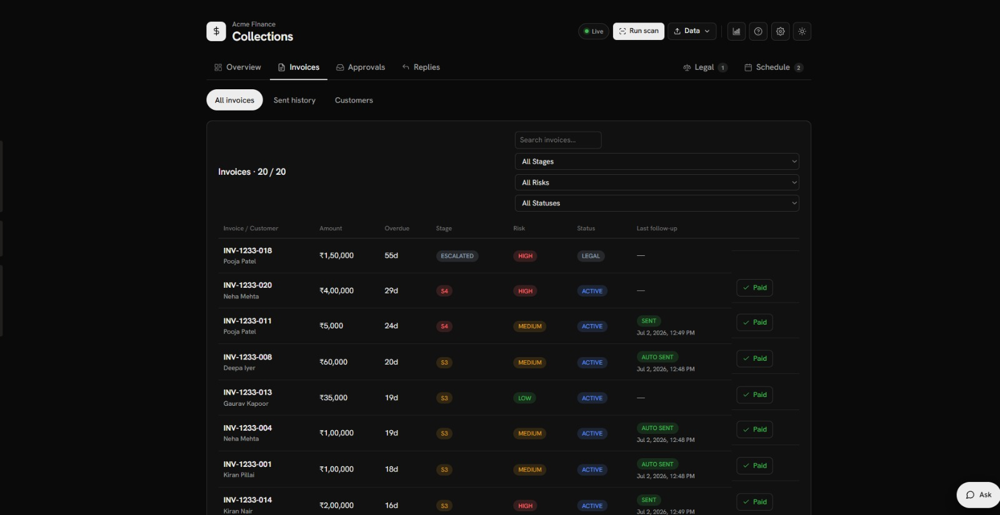
*Invoices — the working queue. Each row shows amount, overdue, stage, risk, status, last follow-up, and a one-click Paid.*

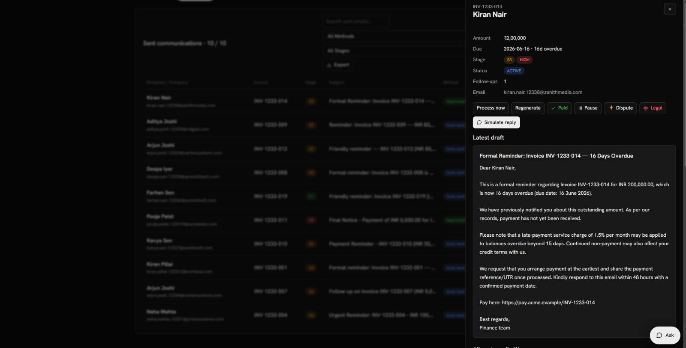
*Per-invoice drawer — status actions (Paid / Pause / Dispute / Legal), the latest AI draft, and full history.*

---

## Escalation logic

| Stage | Days overdue | Tone | Dispatch |
|---|---|---|---|
| Stage 1 | 1–7 | Warm & friendly | Auto |
| Stage 2 | 8–14 | Polite but firm | Auto |
| Stage 3 | 15–21 | Formal & serious | Auto (high-priority) |
| Stage 4 | 22–30 | Stern & urgent | **Human review** (Approvals ▸ Pending) |
| Escalated | 30+ | No email | **Human decision** (Approvals ▸ Escalation) → reviewer escalates to Legal |

Stage 4 and high-risk drafts route to review when human-in-the-loop is on. **30+ day invoices skip email entirely and stay ACTIVE/ESCALATED** in the reviewer's Escalation queue — a person (not the agent) escalates them to the legal team, which posts to Slack `#legal` and moves them to the Legal tab. Reviewers can always override the agent (reactivate, edit, reply).

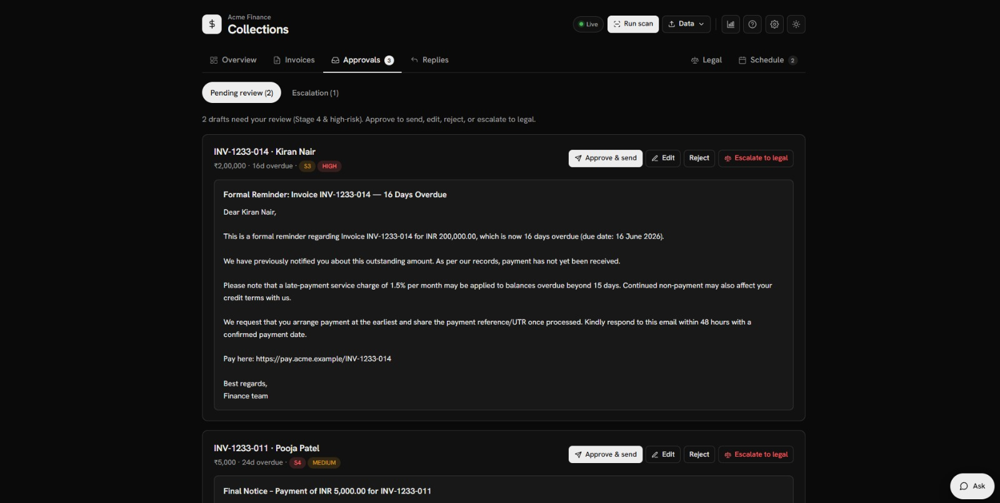
*Approvals ▸ Pending — Stage-4 & high-risk drafts wait here. Approve & send, edit, reject, or escalate to legal.*

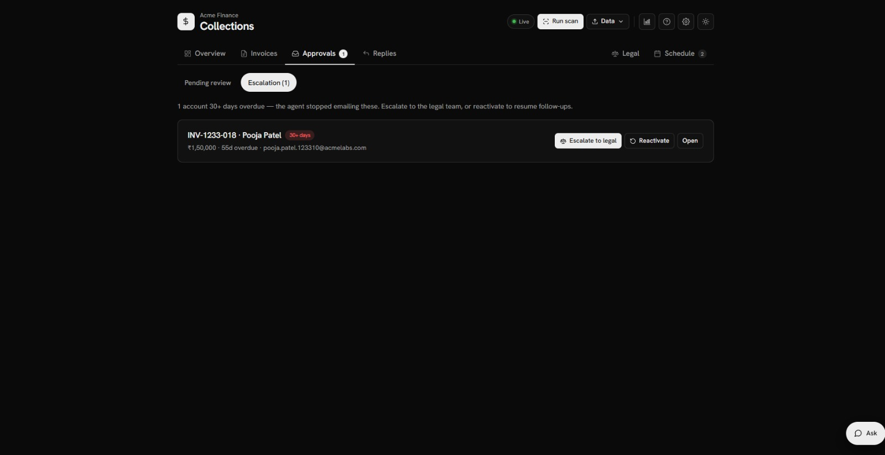
*Approvals ▸ Escalation — 30+ day accounts the agent stopped emailing. The reviewer decides: escalate to legal, or reactivate.*

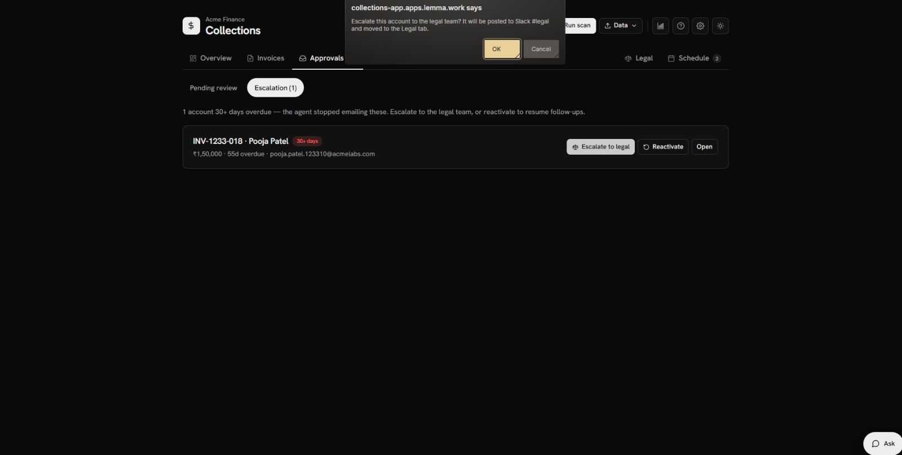
*Escalating an account — it posts to Slack #legal and moves to the Legal tab.*

---

## Reliability — anti-hallucination

The drafter must echo the invoice's real `invoice_no`, `client_name`, `amount`, and `days_overdue` in its output; `validate_draft` cross-checks them against the source record in code (not just prompt instructions), rejects placeholders, and retries. Exhausted retries fall to a deterministic template that always routes to human review. Every email is grounded in stored data — never invented.

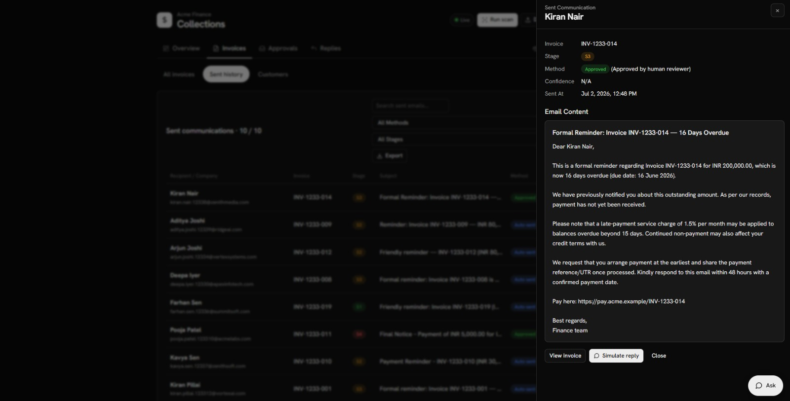
*Sent history — every dispatch is audit-trailed with method (auto-sent vs human-approved), stage, and the exact email content, grounded in the real invoice figures.*

---

## Human loop, replies & audit

Customer replies are read and classified (promise-to-pay / dispute / paid / question). Safe asks (e.g. "send me the payment link") can be answered; anything needing a decision becomes a task in the Replies queue. Every action — auto-send, approval, escalation, reply — is written to an immutable, human-readable audit log.

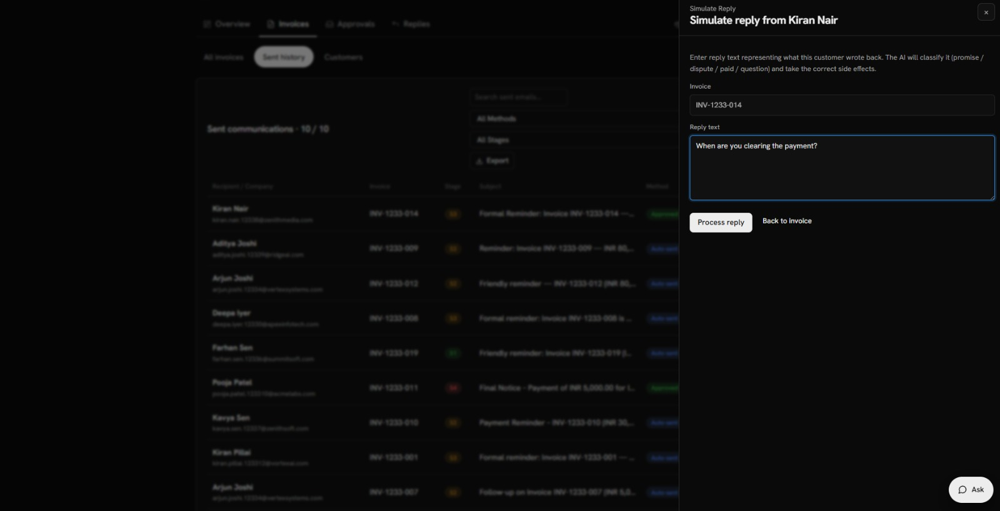
*Replies — paste a customer reply; the AI classifies it and takes the correct side effect (promise / dispute / paid / question).*

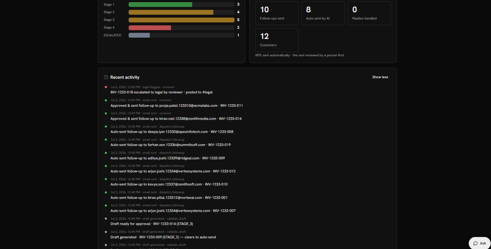
*The audit trail reads in plain English — "Auto-sent follow-up to … · INV-…", "Draft ready for approval …", "INV-… escalated to legal by reviewer · posted to #legal".*

---

## Integrations & services

One `slack` connector powers the legal escalations and the daily digest; a Slack surface powers `#chat`. Telegram runs a managed chat surface plus a bot for the digest. Google Sheets imports invoices; Gmail or a Mailtrap sandbox delivers email.

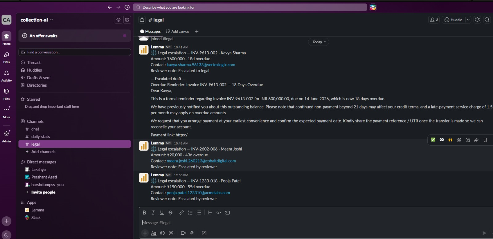
*Slack #legal — every reviewer escalation is posted here for the legal team, with the account, amount, contact and the escalated draft.*

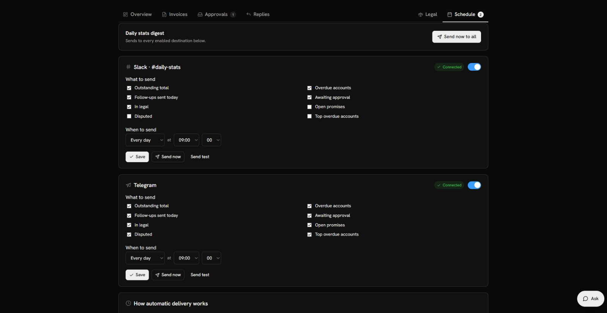
*Schedule — the daily stats digest to Slack #daily-stats and Telegram. Pick what to send and when; send manually any time. Both channels show "Connected".*

- **Slack** (Lemma connector) — `#legal` escalations, `#daily-stats` digest, and a `#chat` surface routed to the concierge. Posts pin a fixed workspace account so scheduled/unattended sends work.
- **Telegram** (Lemma surface) — DM the bot to chat with the pod; digest pushed via a bot token.
- **Google Sheets** (Lemma connector) — import invoices from a sheet.
- **Email** — `IN_APP` (record-only, safe default) · **Mailtrap sandbox** (SMTP — captures every email to any recipient in one test inbox) · **Gmail** (real delivery).
- **Langfuse** (optional) — paste keys in AI Insights for full LLM traces.

---

## Chat with the pod & explainability

The `collections-concierge` agent answers questions over live pod data — on Slack `#chat`, on Telegram, or the docked in-app assistant (rendered as markdown, tool-call noise filtered out).

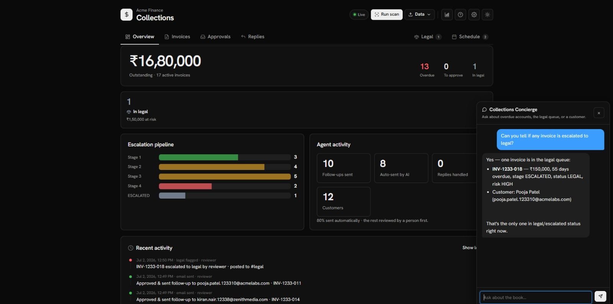
*The Collections Concierge — ask "is any invoice escalated to legal?" and get a live, formatted answer straight from the tables.*

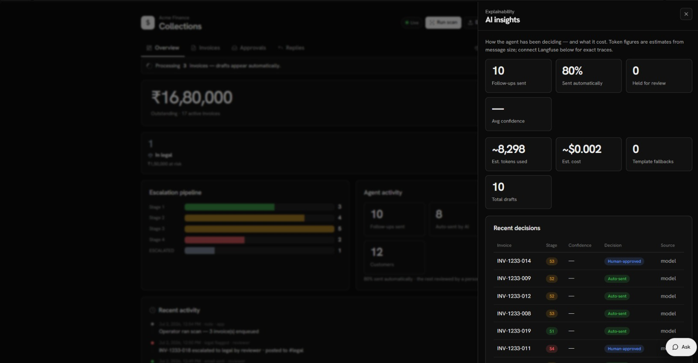
*AI insights — how the agent is deciding: auto vs held-for-review, confidence, template fallbacks, estimated tokens & cost, and a per-decision table. Connect Langfuse for exact traces.*

---

## How the Lemma stack is used

| Layer | In this pod |
|---|---|
| **Tables** | `clients`, `invoices`, `drafts`, `interactions` (audit log), `promises`, `followup_queue`, `stats_channels`, `pod_config` — RLS-shared team data, customer identity keyed by normalized email |
| **Functions** (Python) | `classify_and_score` (stage + deterministic risk), `validate_draft` (anti-hallucination), `dispatch_followup` (send), `make_fallback_draft`, `app_action` (single write-entrypoint for the app), `handle_reply`, `ingest_invoices` / `ingest_from_sheet`, `stats_dispatch`, `seed_demo`, more |
| **Agents** | `collections-drafter` (writes the stage-appropriate email), `reply-triager` (classifies inbound replies), `collections-concierge` (answers questions over live pod data — powers the chat surfaces + in-app Ask) |
| **Workflow** | `collections-run` — a durable per-invoice state machine: classify → route (skip / escalate / draft) → draft → validate → auto-send **or** hold for review |
| **Schedules** | `followup-dispatch` (DATASTORE event — runs the workflow per queued invoice), `daily-scan` (TIME), `stats-dispatch` (TIME `*/30` — the digest sweep), `heal` (retry stuck runs) |
| **Connectors** | **Slack** (`chat_post_message` → #legal, #daily-stats), **Google Sheets** (invoice import), **Gmail** (optional real send) |
| **Surfaces** | **Slack** (#chat → concierge) and **Telegram** (DM the concierge) |
| **App** | Single-file HTML operator UI deployed to the pod (`collections-app`) |

### The workflow, in short

```
followup_queue INSERT
      │
   classify_and_score ── status≠ACTIVE ─────────────► complete
      │                └ 30+ ESCALATED ─────────────► complete (stays ACTIVE, waits for reviewer)
      ▼
   collections-drafter (RAG-grounded draft)
      ▼
   validate_draft ── fail ─► make_fallback_draft ─► (review)
      │ pass
      ▼
   needs review? ── yes ─► hold PENDING_REVIEW (Approvals)
      │ no
      ▼
   dispatch_followup (auto-send)  ──►  interactions audit log
```

---

## Settings & setup

Everyday preferences live in Settings; the one-time technical wiring lives in the Setup guide, so the rest of the app stays clean.

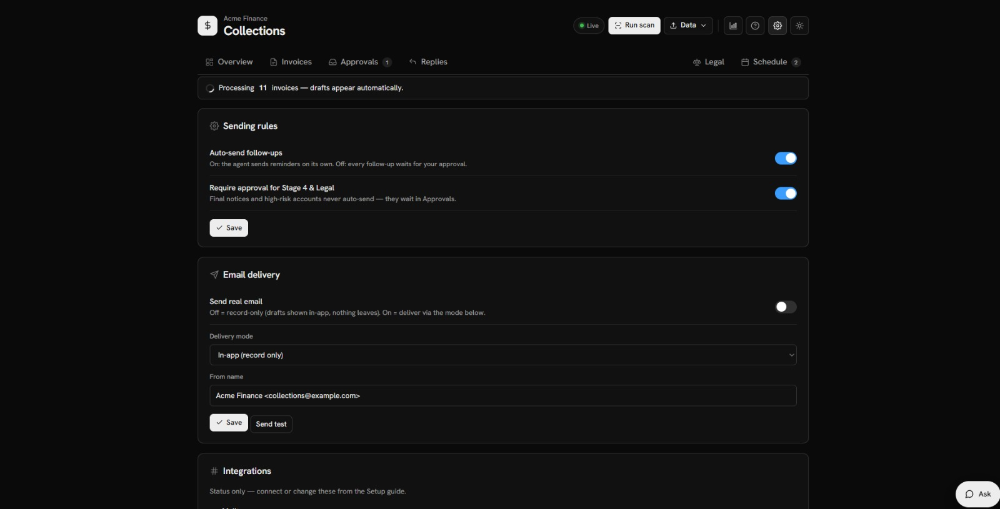
*Settings — two clear sending rules (auto-send on/off, require approval for Stage 4 & Legal) and the email-delivery mode.*

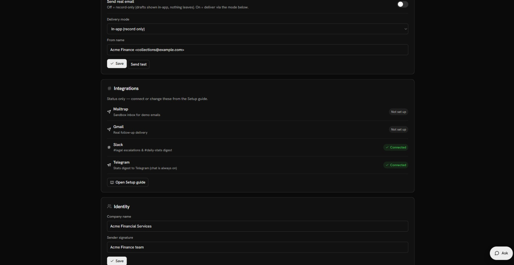
*Settings — a read-only integration status board (Mailtrap, Gmail, Slack, Telegram).*

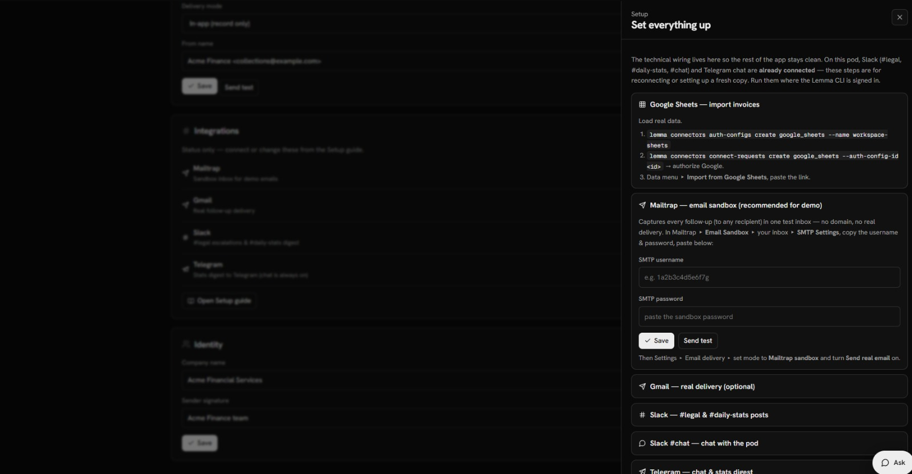
*Setup guide — self-serve wiring for Google Sheets, Mailtrap, Gmail, Slack and Telegram, kept out of the everyday UI.*

The UI also has modern loading states so long actions feel responsive:

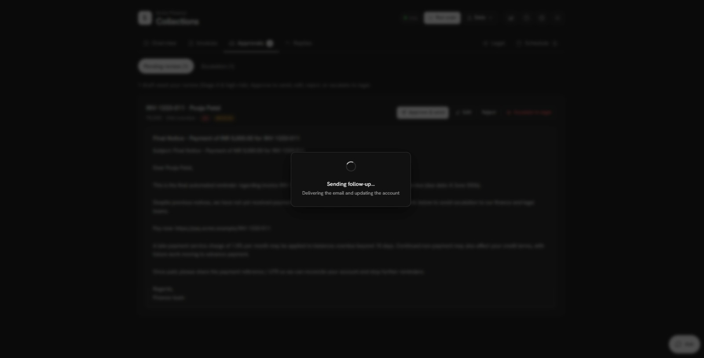 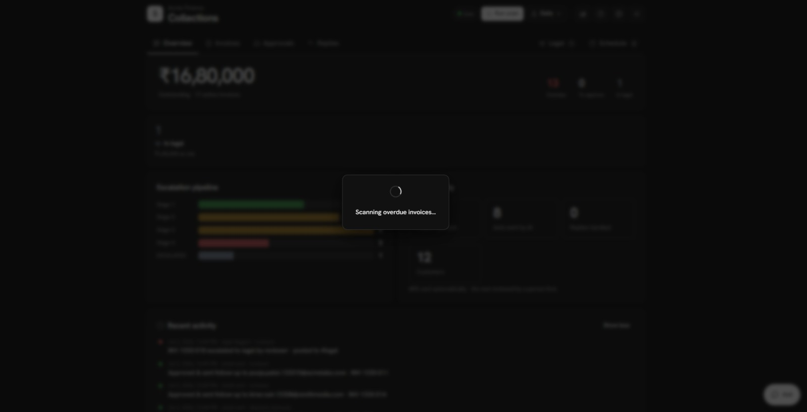
*Contextual loading — "Sending follow-up…" while an email dispatches, "Scanning overdue invoices…" during a scan.*

---

## Access, users & onboarding

**The pod is private.** The app is `visibility: POD` — only members of the `collections-agent` pod (in the *Followup Lemma* org) can open it. There is no public URL access.

**Intended user flow:**
1. **Admin/owner** sets up the pod once: connects Slack + Google Sheets, sets the Slack channel ids and the pinned account, resumes the `stats-dispatch` schedule.
2. **Team members are invited to the pod** and given permissions — they then open the same app at the live URL and sign in with their Lemma account.
3. Everyone works one shared workspace: the **collector** works Invoices/Replies, the **reviewer** works Approvals, the **legal team** works the Legal tab, the **finance lead** owns Schedule/Settings.

**Adding a user:** invite a teammate to the pod (org admin), then they open the app URL and sign in. Each member acts under their **own delegated identity** (Lemma's model), so RLS and connector calls resolve to that person where relevant.

**Do users each need their own integrations?** No. **Slack, Google Sheets, and the digest are pod-level** — connected once by an admin and shared. The only per-user piece is **Gmail** *if* you choose real per-sender delivery; for the demo, Mailtrap sandbox or IN_APP needs nothing per-user.

---

## Demo / verification

```bash
# target the pod (set once)
lemma config set-default-org <followup-lemma-org> && lemma config set-default-pod <collections-agent-pod>

lemma functions run seed_demo --data '{"enqueue":true,"count":26}'   # realistic mixed book
# ~1 min later, the pipeline has auto-sent the safe ones and queued the rest:
lemma query run "select status,count(*) from invoices group by status"
lemma query run "select status,count(*) from drafts group by status"     # AUTO_SENT + PENDING_REVIEW
lemma functions run stats_dispatch --data '{"mode":"test","channel":"SLACK"}'   # digest to #daily-stats
```

Open the app: Overview shows the book; Approvals ▸ Pending has Stage-4 drafts, Approvals ▸ Escalation has the 30+ accounts; escalate one and watch it appear in the Legal tab and Slack `#legal`.

Reset anytime: `lemma functions run reset_pod --data '{"confirm":true}'`.
